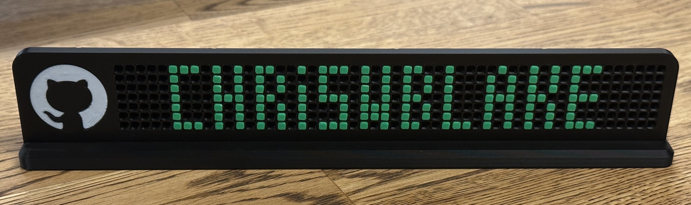

# GitHub Contribution Graph Desk Nameplate

A GitHub contribution graph themed desk nameplate.

- 3 pieces (stand, nameplate, colored inserts)
- Colored dots are printed separately and easy to insert to customize post-printing.

## How to Build

### Prerequisites

- 3D printer with 250mm width.
- Black filament
- White filament
- Green filament

### Print the parts and assemble

1. Preview the model files in the `./models/` folder.
   - Nameplate - vertical part with grid
   - Insert - the colored dots to insert in the grid
   - Stand - horizontal part to hold nameplate
1. Open `.3mf` file or load the `.stl` files into your slicing software.
1. Print the parts. No special settings are required.
1. Insert colored dots into the grid to spell your name or decorate! You can use the [nametag-planner.xlsx file](docs/nametag-planner.xlsx) to make your design.
1. Share your design on the repo [Show and Tell](https://github.com/chriswblake/github-desk-nameplate/discussions/1) page!  
(and secretly your now even _more_ awesome desk setup)

> [!TIP]
> Print the inserts in different colors! 🦄

## Contributing

All files are available, including the original Fusion `.f3d` files. Pull requests are welcome.

### Easy contribution ideas

- Alternative stands
- Other decorations using the insert shape.
